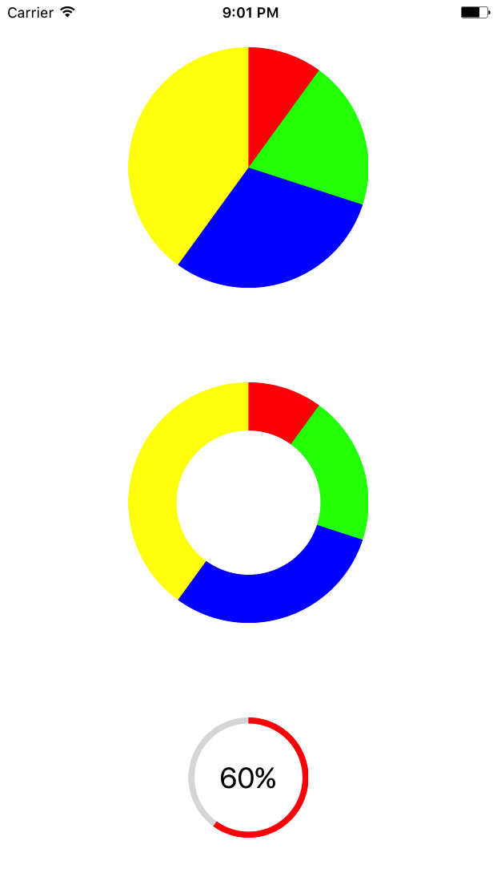
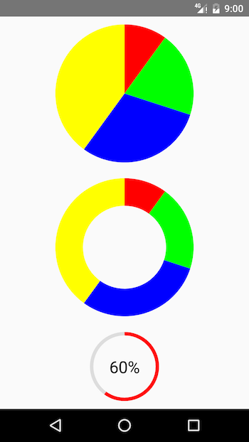

# react-native-pie

Pie chart for React Native, works on both **iOS** and **Android**

## Demo




## Install

```bash
# NPM
npm i --save react-native-pie
OR
# Yarn
yarn add react-native-pie
```

## For react-native-pie >= 1.1.0 install peer dependency
```bash
# NPM
npm i --save @react-native-community/art
OR
# Yarn
yarn add @react-native-community/art
```

## Migration from react-native-pie <= 0.6.2

Please unlink react-native ART library

## Linking module

### Mostly automatic linking

If `react-native` >= 0.60 && react-native-pie >= 1.1.0, the package will be linked automatically.

### Manual linking for react-native-pie <= 0.6.2
Link the ART library to your ReactNative project ([how to link a library](https://facebook.github.io/react-native/docs/linking-libraries-ios.html#content)). You'll find the React ART library in `node_modules/react-native/Libraries/ART/ART.xcodeproj`


### React Native Version Support
> **If you are using < `.45`, please install `react-native-pie` `v0.1.0` instead**   
> `npm i --save react-native-pie@0.1.0`

> **Please use >= `0.50.0-rc.0` otherwise there is a ring shape drawing issue with `react-native-pie`**

## Usage

```jsx
import React from 'react'
import {
  StyleSheet,
  View,
  Text,
} from 'react-native'
import Pie from 'react-native-pie'

export default () => {
    return (
      <View style={styles.container}>
          <View
            style={{
              paddingVertical: 15,
              flexDirection: 'row',
              width: 350,
              justifyContent: 'space-between',
            }}
          >
            <Pie
              radius={80}
              sections={[
                {
                  percentage: 10,
                  color: '#C70039',
                },
                {
                  percentage: 20,
                  color: '#44CD40',
                },
                {
                  percentage: 30,
                  color: '#404FCD',
                },
                {
                  percentage: 40,
                  color: '#EBD22F',
                },
              ]}
              strokeCap={'butt'}
            />
            <Pie
              radius={80}
              innerRadius={50}
              sections={[
                {
                  percentage: 10,
                  color: '#C70039',
                },
                {
                  percentage: 20,
                  color: '#44CD40',
                },
                {
                  percentage: 30,
                  color: '#404FCD',
                },
                {
                  percentage: 40,
                  color: '#EBD22F',
                },
              ]}
              strokeCap={'butt'}
            />
          </View>
          <View
            style={{
              paddingVertical: 15,
              flexDirection: 'row',
              width: 350,
              justifyContent: 'space-between',
            }}
          >
            <Pie
              radius={80}
              innerRadius={60}
              sections={[
                {
                  percentage: 10,
                  color: '#C70039',
                },
                {
                  percentage: 20,
                  color: '#44CD40',
                },
                {
                  percentage: 30,
                  color: '#404FCD',
                },
                {
                  percentage: 40,
                  color: '#EBD22F',
                },
              ]}
              dividerSize={4}
              strokeCap={'round'}
            />
            <Pie
              radius={80}
              innerRadius={60}
              sections={[
                {
                  percentage: 10,
                  color: '#C70039',
                },
                {
                  percentage: 20,
                  color: '#44CD40',
                },
                {
                  percentage: 30,
                  color: '#404FCD',
                },
                {
                  percentage: 40,
                  color: '#EBD22F',
                },
              ]}
              dividerSize={6}
              strokeCap={'butt'}
            />
          </View>
          <View
            style={{
              paddingVertical: 15,
              width: 350,
              flexDirection: 'row',
              justifyContent: 'space-between',
            }}
          >
            <Pie
              radius={80}
              sections={[
                {
                  percentage: 10,
                  color: '#C70039',
                },
                {
                  percentage: 20,
                  color: '#44CD40',
                },
                {
                  percentage: 30,
                  color: '#404FCD',
                },
                {
                  percentage: 40,
                  color: '#EBD22F',
                },
              ]}
              dividerSize={6}
              strokeCap={'butt'}
            />
            <View style={{ width: 175, alignItems: 'center' }}>
              <Pie
                radius={80}
                innerRadius={75}
                sections={[
                  {
                    percentage: 60,
                    color: '#f00',
                  },
                ]}
                backgroundColor="#ddd"
              />
              <View
                style={styles.gauge}
              >
                <Text
                  style={styles.gaugeText}
                >
                  60%
                </Text>
              </View>
            </View>
          </View>
        </View>
    )
  
}

const styles = StyleSheet.create({
  container: { alignItems: 'center', justifyContent: 'center', height: 1050 },
  gauge: {
    position: 'absolute',
    width: 100,
    height: 160,
    alignItems: 'center',
    justifyContent: 'center',
  },
  gaugeText: {
    backgroundColor: 'transparent',
    color: '#000',
    fontSize: 24,
  },
})
```

## Props

* **sections** `{percentage, color}` of each section in the pie - array, **required**
* **radius** `radius = size / 2` , - number, **required**
* **innerRadius** defaults to `0` - number, **optional**
* **backgroundColor** defaults to `#fff` - string, **optional**
* **strokeCap** ( `round` , `butt` ) defaults to `butt` - string, **optional**
  * **PLEASE NOTE** If using `strokeCap={'round'}` it is highly recommended to use a higher `innerRadius` (around 60% of `radius` and higher) in addition to not having very small percentage sections. This will ensure proper display. We hope to address these issues in future PRs
* **dividerSize** defaults to `0` - percentage size to divide the sections - number, **optional**

## License

MIT

